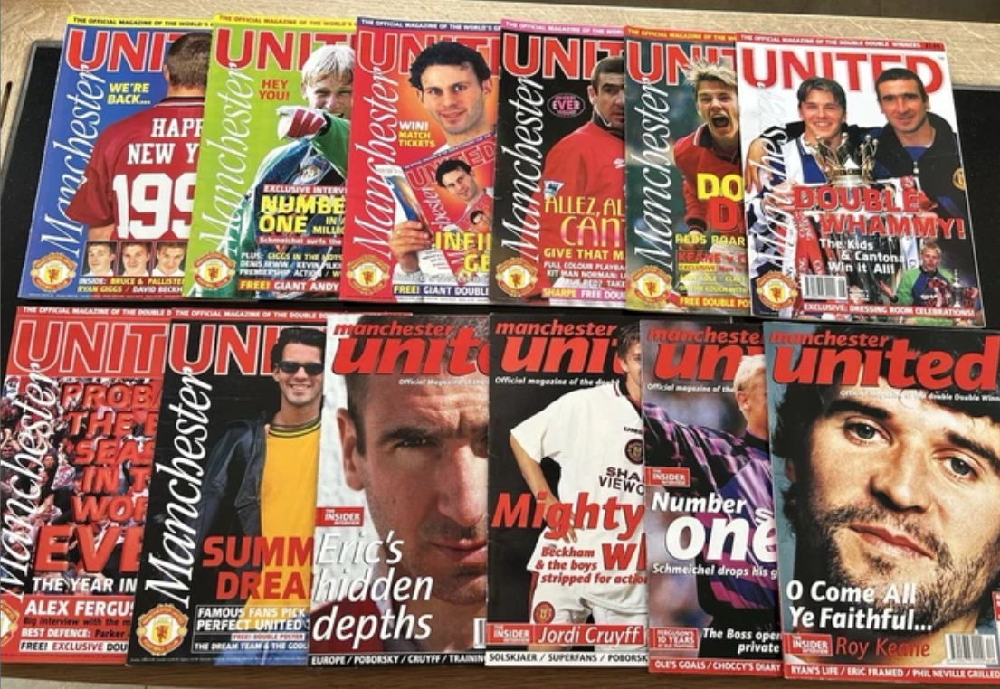

## Python/API - Sports Articles Performance Analysis




**View the Power BI Report [here](https://project.novypro.com/SOf07j)**

### 1. Project Overview
This project focuses on enriching and analyzing sports article performance for a media company. It involves building an automated data enrichment pipeline, integrating external APIs for player information, and conducting performance analysis. The solution transforms sparse article metadata into actionable insights by adding contextual tags and player position data, enabling data-driven content strategies to maximize engagement and pageviews.
________________________________________

### 2. What is Article Enrichment and Why is it Important?
Article enrichment involves enhancing raw content metadata with additional contextual information to enable deeper analysis. For sports media companies, understanding what content drives engagement is critical for editorial strategy and revenue optimization. By enriching articles with contextual tags and player positions, companies can identify high-performing content types and make informed decisions about resource allocation and content planning.
________________________________________

### 3. Project Target
The project aims to:

- **Data Enrichment:** Extract contextual information from raw HTML to create meaningful article tags beyond simple player names.
- **API Integration:** Retrieve player position data from external sports databases to enable role-based performance analysis.
- **Performance Analysis:** Identify which content types, player positions, and article characteristics drive the highest engagement.
- **Scalability Planning:** Design solutions that can efficiently handle 5,000+ articles while addressing rate limits and data quality challenges.
________________________________________

### Stage 1: Article Tag Enrichment via HTML Analysis
**Connecting to Data Sources**

To start, I loaded the article dataset containing URLs, existing tags, and basic metadata:

- Imported necessary libraries: `pandas`, `requests`, `BeautifulSoup`
- Loaded the article CSV file into a DataFrame
- Validated data structure using `df.head()` and `df.info()`

**Fetching and Parsing HTML Content**

I built a scraping pipeline to extract full article text:

- Used `requests.get()` to fetch HTML from each article URL
- Implemented error handling for failed requests and timeouts
- Parsed HTML with BeautifulSoup to extract clean text content
- Created a `clean_text` column containing the article body

**Creating Contextual Tags**

To enrich the sparse metadata, I developed rule-based tag inference:

- **EventType:** Classified articles as Transfer, Injury, Match, Interview, or General using keyword matching
- **Sentiment:** Analyzed tone as Positive, Negative, or Neutral based on language patterns
- **Length:** Categorized as Short (<300 words), Medium (300-800), or Long (>800 words)

```python
def infer_event_type(text):
    if any(keyword in text.lower() for keyword in ['transfer', 'signing', 'deal']):
        return 'Transfer News'
    elif any(keyword in text.lower() for keyword in ['injury', 'injured', 'sidelined']):
        return 'Injury'
    # Additional logic...
```
________________________________________

### Stage 2: Player Position Enrichment via API Integration
**Extracting Player Names**

I implemented a hierarchical approach to identify players:

- **Priority 1:** Extracted from existing `Tags` field
- **Priority 2:** Used `Pri. Tag` (primary tag) as fallback
- **Priority 3:** Parsed first 800 characters of `clean_text` for player mentions
- Applied blocklist filtering to remove teams, leagues, and journalists

**Integrating TheSportsDB API**

To retrieve accurate position data, I connected to TheSportsDB:

- Implemented API calls with rate limiting (1 request/second)
- Queried player information using player names
- Extracted strPosition field from API responses
- Normalized positions into 5 categories: Forward, Midfield, Defender, Goalkeeper, Coach

**Handling Edge Cases**

I built robust error handling for real-world scenarios:

- Cached API results locally to avoid redundant calls
- Marked non-player articles as "Other" category
- Implemented retry logic for failed API requests
- Created fallback mechanisms for ambiguous player names
________________________________________

### Stage 3: Performance Analysis in Python
**Calculating Key Metrics**

I developed performance indicators for content analysis:

- **Total Pageviews (PV)** by position and content type
- **Click-Through Rate (CTR)** across different article categories
- **Article Distribution** by position and event type
- **Top Performers** analysis by player and content category

**Identifying Patterns**

Using pandas and data aggregation, I analyzed trends:

- Grouped articles by position using groupby()
- Calculated average metrics: df.groupby('position')['pageviews'].mean()
- Identified high-performing content segments
- Created comparison tables for strategic recommendations

```python
# Example analysis
position_performance = df.groupby('position').agg({
    'pageviews': ['sum', 'mean'],
    'ctr': 'mean',
    'article_id': 'count'
}).round(2)
```
________________________________________


### Stage 4: Visualization and Insights
**Creating Visual Analysis**


I generated visualizations to communicate findings:

- **Bar charts:** Article distribution by position
- **Comparison charts:** Average pageviews and CTR by position
- **Top 10 lists:** Most mentioned players/coaches
- **Performance tables:** Detailed metrics by content category

**Key Findings**

The analysis revealed actionable insights:

- **Coach content drives 94% higher traffic** than defender-focused articles
- **Goalkeeper content has highest CTR** at 10.18% (120% above forwards)
- **"Other" category strong performer** with 28,027 pageviews (investigate team news)
- **90.9% enrichment success rate** with player and position data
________________________________________

### Content Strategy Recommendations
**PRIORITIZE:**

- Coach Drama content (Amorim, Arteta, Alonso) → 30K+ pageviews
- Goalkeeper Moments → 10%+ CTR
- "Other" Sagas (club crises) → 28K pageviews

**AVOID:**

- Solo forward transfer rumors → 4.6% CTR

**FORMAT WINNERS:**

- Manager Watch (weekly series)
- Save of the Week features
- Underrated Defenders spotlights
- Transfer Sagas without named players
________________________________________

### Key Takeaways

1. **Automated enrichment is scalable:** Rule-based tagging processes 5,000 articles in <10 minutes
2. **API integration adds accuracy:** External data sources provide verified player information
3. **Position-based analysis reveals opportunities:** Coach content significantly outperforms other categories
4. **Data-driven content strategy:** Quantifiable metrics enable informed editorial decisions
5. **Robust error handling is essential:** Fallback mechanisms ensure 90%+ success rate in real-world scenarios


**Technologies Used:** Python, Pandas, Requests, BeautifulSoup, TheSportsDB API, Matplotlib/Seaborn
